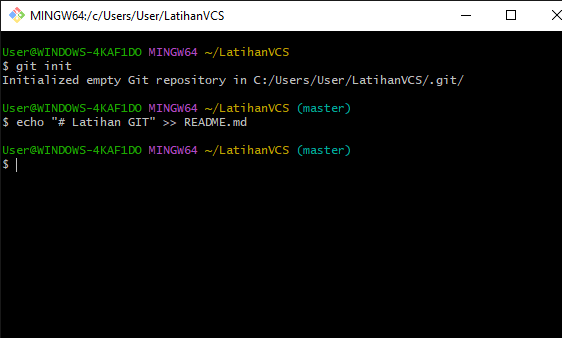
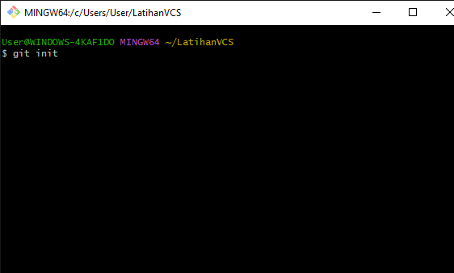
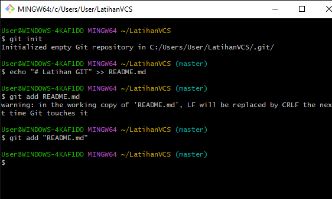
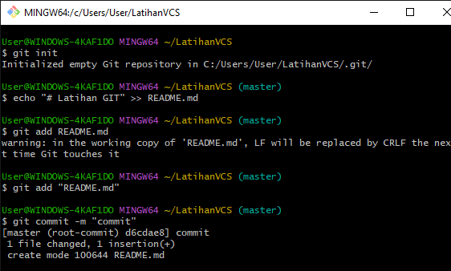
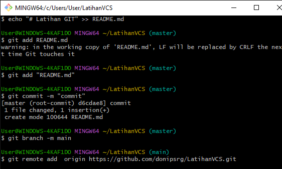
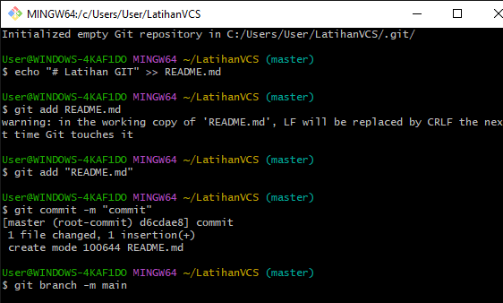
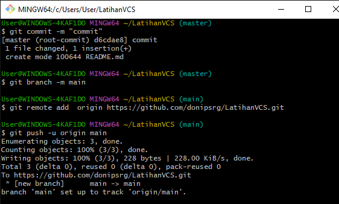

- NAMA: DONI PERDANA SIRINGORINGO
- NIM: 312210678
- KELAS: TI.22.B1
-----------------

# Latihan GIT
## Cara Penggunaan GIT
1. pertama kita harus kunfigurasi global aku yaitu name dan email agar kita tidak error ketik git commit
   

2. Membuat repository baru dilokal
   

3. Selanjutnya kita akan membuat file README.md dan langsung inisialisasi dengan cara dibawah ini
   

4. Untuk menambahkan file tersebut / perubahan pada file staging sebelum proses commit

 

5. Setelah itu simpan perubahan yang terjadi dengan mengetikkan perintah berikat
   

6. sekarang kita akan lakukan remote  sebagai berikut

7. langsung kita atur  branch repository kita

8. Selanjutnya kita push dengan perintah berikut

Selesai kita telah mengupload repository lokal kita ke github

   
